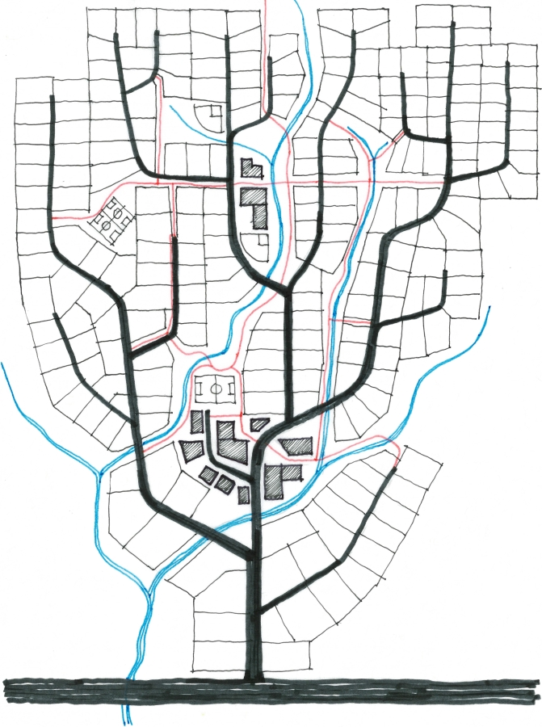
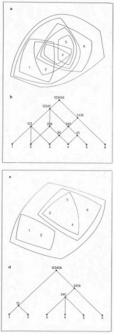

# "no DOM is an iland"

## Installation
- Install brew
- brew tap heroku/brew && brew install heroku
- git remote -v

## Ideas

### "A City is not a Tree"

_A city is a tree_ or, _A Tree is a city_

Arguably the seminal work on the above idea is from Christopher Alexander, and it can be found [here](http://www.bp.ntu.edu.tw/wp-content/uploads/2011/12/06-Alexander-A-city-is-not-a-tree.pdf). I knew of Christopher Alexander's work for years, and have gone through my copy of the Pattern Language time and time again, but I did serendipitously stumble upon this just at the right time.

The idea I am investigating is indeed the opposite, if I can make a city out of tree structures. It is also the idea of making a room out of tree structures, and making all these so a user can traverse them comfortably. It may well be that as a user traverses these web resources (URIs) a new structure is created, something akin to a city per browsing history. But that is still in the assumptions bucket indeed.

The perceived difference of opinions that I would have had with Christopher Alexander's work is definitely perceived. Why would he even write an essay on this subject if the tree structure was not close enough to decribe a city? Indeed it is the way some architects have design cities, albeit not that good of a design, by Alexander's opinion. And I agree. It is the complexity of the semi-lattice that really gives life to a city. 

Semi-lattice VS. tree

The interconnections of the HTML DOM tree (links called URL fragments, e.g. `href=”#chapter2”`), or the tree of internal links ia an extra reading that talks not about how the island/city gets structure, but how it **works**. It creates roads, veins, rivers, or pathways from one place to the other.
where the tree path is like the bold line shown below, and the other lines are informed by the interconnections.

What is the part that makes a city _not a tree_? Highlight that, map it to the idea of a web site/domain as building graph, or a web page as a room graph, or a web history as a city graph. There you have the interactions. It is the inter-connections between the URIs that show the interactions within these elements.

### Service
Service that responds with JSON of `nodes + data + x,y` and `edges + data` for:

- Route that gets url from POST data, knows the type of JSON expected, returns JSON 
  - module dom2Graph (run if possible, get x,y) and cache response.
    - module dom2Json for sigma
      - sigma.js in node 
    - module dom2Json for ngraph
      - ngraph in node
    - module dom2Json for d3
      - d3 in node
    - module dom2Json ...
      - ... in node
      - 
Try to make as little deviation as possible, extra data ok. Test schemas with extra data also work with simpler ones.

The service will compute the x,y in the server so we can take advantage of just adding the nodes in the client, with simple physics.
A 3d island visualisation only needs the x,y as it would be coming up fro mwater
Also will lru-cache the results for a while.

The client can then use:
- view layer of any visualisation
- themes per view layer

The service can then be called by something like Unity, etc.

### Useful links
- [Bounding boxes](https://stackoverflow.com/questions/23073170/calculate-bounding-polygon-of-alpha-shape-from-the-delaunay-triangulation)

### Options / Landing page
- [ ] Redesign, responsive, mobile
- [ ] Options:
  - [x] Web-page
  - [ ] Web-site (internal links)
    - [ ] Define internal links: domain name or first slash, second slash, ...
    - [ ] Maximum depth of followed internal links (5, 10, 15 ...for caching purposes every 5)
  - [x] 2d
  - [x] 3d
    - [ ] theme: circles / starry sky
  - [x] island
    - [ ] maximum children per node (default:12, max: Infinity)
    - [ ] voronoi / delaunay / other
    - [ ] night / day / time at place of website
    - [ ] weather effects (on/off)
  - [ ] city

### Roadmap
- [x] Move to service architecture - v1
- [x] Make test pages (Currently if the service has no connectivity to the net, it will load a hardcoded tsouk.com JSON response)
- [x] Implement simple 3d ngraph approach
- [x] Implement 2d ngraph
- [x] island implementation v1
- [x] Remove that flavour stuff
- [x] Move ngraph.pixel in the node_modules instead. BUT bundles can be made outside
- [x] social image
  - [x] good sceernshots
- [x] copy three.js setup for watch, make repeat.

- [ ] Upgrade to Node8
- [ ] night sky, sea
- [ ] Clear timeout later than the last child (COOLOFF_PERIOD)

- [ ] Sea is part of the landscape bug.
  - [ ] It's the +1 for depthOfChild that is happening in recurseBF

- [ ] Static versioned that sits in drop down.

- [ ] fly by camera!
- [ ] We are off by 4 faces in tsouk. 
- [ ] Orthocamera would be nice... try well

- [ ] 2d Cezar shapes.
- [ ] look into earcut: https://github.com/mapbox/earcut
- [ ] 3d Hanami for Hanami season...
- [ ] Lodash is now in ilandom, maybe should be only in ngraph.three 
- [ ] ADD SOUND!
- [ ] favicon
- [ ] ALPHA SHAPES: https://github.com/mikolalysenko/alpha-shape
- [ ] Voronoi

- [ ] Many children circle / sphere issue
  - [ ] consider them a different thing
  - [ ] clouds
  - [ ] roots, depth

- [ ] Heights(no. of children, data, centrality, depth)
  - [ ] a non linear height function might work better.
  - [ ] Count node centrality and raise the node is so.
  - [ ] HTML validator
  - [ ] ads
  - [ ] errors / console.logs

- [ ] Google page rank

- [ ] Redoing the surface:
  -  Circular shapes (or turrets): These are created when too many children form unilateraly around the parent. The ideal solution would be in the layout algorithm (1). The next solution would be affecting the heights. A `MAX_CHILDREN_PER_NODE` parameter is used to alleviate the problem now. This is not ideal because some of these children hold most of the rest of the website. So a first pass that gets information from the DOM is important. Should reconsider cheerio here to figure out a better data object to begin with, or add info to the nodes.
- [ ] a Mirrored iland underneath, the roots of the island. must be a different delaunay. different graph layout. edges can connect. 
- [ ] light houses, greek windmills
- [ ] For any node with no children, should add seanodes based on it's (maxDepth - depth), to make the form more rounded.
- [ ] the leftover nodes of mountains are layout3d ngraph clouds.
- [ ] the mountain will slowly grow
- [ ] snow/weather coming off
- [ ] island implementation v2
- [ ] a nurbs / plane geometry version
- [ ] a mortphNormals non-buffer Geometry version

If anything, thanks to Prof. Tomimatsu for loving this idea back n 2008, and also to Matt and Tom for the same interest. To the people writing awesome open source graph and 3D code and to my friends for actually showing interest whenever I am talking crazy.
